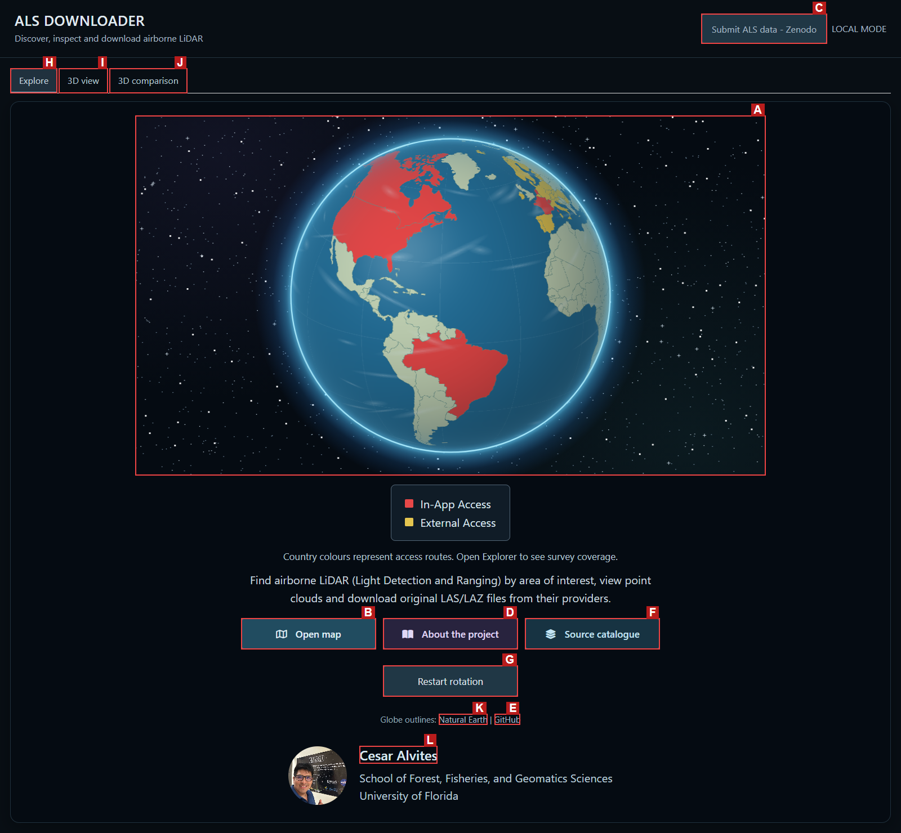
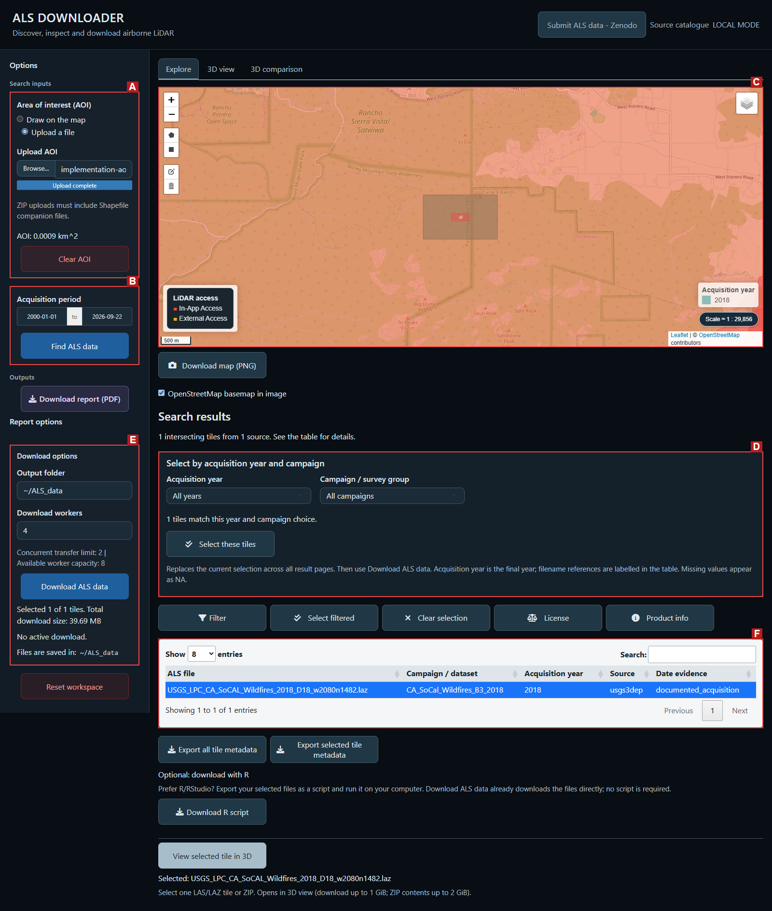

[](https://www.gnu.org/licenses/gpl-3.0)
[](NEWS.md)
[](#get-started)
[](https://cesarito2021.r-universe.dev/ALSdownloadeR)
[](https://github.com/Cesarito2021/als_downloader/releases)
[](https://github.com/Cesarito2021/als_downloader/archive/refs/heads/main.zip)

### ALS Downloader: a web-based Shiny application for the discovery, management, visualization, and download of airborne laser scanning (ALS) datasets worldwide

**Developed by Cesar Alvites**<br>
School of Forest, Fisheries, and Geomatics Sciences, University of Florida

ALS Downloader links a user-defined area of interest (AOI) to available airborne LiDAR surveys. Users can identify and select tiles, download the original point cloud files in parallel, inspect point clouds interactively, and compare overlapping acquisitions. All data remain hosted by the originating providers. The catalogue combines direct data access with links to national portals, and spatial coverage varies by source.

## User interface

Start with the globe, then open **Explore** to find tiles. **3D view** inspects a
selected tile or local file; **3D comparison** brings overlapping clouds together.



**A.** Globe and access routes (red: in-app; yellow: external portals). **B.** Open map. **C.** Submit ALS data. **D.** About the project. **E.** GitHub. **F.** Source catalogue. **G.** Restart rotation. **H.** Explore. **I.** 3D view. **J.** 3D comparison. **K.** Natural Earth. **L.** Author website.

### Explorer



**A.** Define the AOI. **B.** Set the acquisition period and search. **C.** Inspect tile footprints on the map. **D.** Select years and campaigns. **E.** Configure downloads and export the PDF report. **F.** Inspect tiles and export metadata or an R download script.

## Get started

Install from **[R-universe](https://cesarito2021.r-universe.dev/ALSdownloadeR)** when available, or use GitHub below.

```r
install.packages("ALSdownloadeR", repos = c(
  "https://cesarito2021.r-universe.dev",
  "https://cloud.r-project.org"
))
install.packages("lidR")
ALSdownloadeR::launch_app()
```

The browser is the interface; R runs the application on your computer. To start explicitly in local mode:

```r
ALSdownloadeR::launch_app(mode = "local")
```

Local mode saves files to your chosen folder and supports parallel transfers. The effective worker count is limited by available cores (reserving four when possible), selected tiles and the configured transfer limit (two by default). A public server running in `hosted` mode uses one worker. Where a provider permits more connections, configure the limit when launching, for example `launch_app(mode = "local", provider_limit = 4L)`.

Alternatively, install the development source from GitHub:

```r
install.packages(c("remotes", "lidR"))
remotes::install_github("Cesarito2021/als_downloader")
ALSdownloadeR::launch_app()
```

Requires R ≥ 4.1. `lidR` enables point-cloud reading. PDF reports also require `rmarkdown`, Pandoc and a LaTeX installation such as TinyTeX. The GitHub ZIP contains software source, not LiDAR files. [Installation and workflow guide](vignettes/als-workflow.Rmd).

The R package is named **`ALSdownloadeR`**. The repository remains `als_downloader` to preserve existing links.

## ALS Data Catalog

| Integrated source | Access |
|---|---|
| **USGS 3DEP**, USA | Official USGS catalogue and original LAZ files |
| **OpenTopography**, international | Audited hosted ALS catalogue; original tile indexes load automatically for the AOI |
| **CanElevation**, Canada | Official spatial tile service and original point clouds |
| **AHN6**, Netherlands | Spatial index and LAZ files |
| **swissSURFACE3D**, Switzerland | Spatial catalogue and LAS archives |
| **IGN LiDAR HD**, France | Spatial catalogue and COPC files |
| **Approved community sources** | Reviewed boundaries linked to provider-hosted files |

Other countries link to their official download portals. [Full source catalogue](inst/sources/SOURCES.md).

## ALS Downloader Stats

The audited OpenTopography portion of ALS Downloader connects users to over **1.05 million files (42.6 TB)** hosted by the original providers.

| OpenTopography snapshot · 20 September 2026 | Verified count |
|---|---:|
| Integrated airborne-LiDAR collections / survey footprints | 428 |
| Tile-footprint records in their indexes | 1,056,156 |
| Unique file objects, after removing shared-file duplicates | 1,056,011 |
| Original-file storage, from public object sizes | 42.598 TB (38.743 TiB) |

Counts cover the audited OpenTopography collections, excluding federated 3DEP and external-only entries. [Inventory and methods](https://github.com/Cesarito2021/als_downloader/blob/main/docs/COVERAGE_STATISTICS.md).

## Input data

- **Study area:** draw a polygon or rectangle, or upload an AOI file.
- **Acquisition period:** choose dates, then select tiles by year and campaign or directly in the table.
- **Download folder and workers:** choose where to save files and how many transfers to run in parallel.
- **Local point cloud (optional):** open a LAS/LAZ file for 3D viewing or comparison.

## Outputs

* **Point clouds:** download original LAS/LAZ files or provider ZIP archives directly with **Download ALS data**.
* **Figures (PNG):** AOI and tile maps, point-cloud views, and available comparison profiles and distributions.
* **Metadata and scripts:** tile metadata (CSV) and an optional **Download R script** for running downloads locally in R/RStudio.
* **Download report (PDF):** a concise summary of the AOI, selected tiles, acquisition dates, total download size (MB or GB; incomplete totals are labelled), available figures and source credits.

**Recommendation:** review the PDF before downloading to check the selected tiles and reported storage requirements. File sizes may be unavailable from some providers.

Acquisition year is the final year of acquisition; filename references are labelled, and unavailable years appear as **NA**. Viewing or comparing remote point clouds temporarily downloads the selected files.


**A.** Tile table (USGS, California). **B.** Point-cloud view (AHN6, Groningen). **C.** Overlapping USGS acquisitions in Apalachicola, with a profile and elevation histogram. **D.** PDF report excerpt (USGS, California). Panels show separate real examples. [Sources and figure preparation](https://github.com/Cesarito2021/als_downloader/blob/main/docs/README_FIGURES.md).

## Point-cloud examples

Four source datasets viewed from above and coloured by elevation. Click an image to enlarge it. [Figure credits](https://github.com/Cesarito2021/als_downloader/blob/main/docs/README_FIGURES.md).

### 1. USA · Utah

USGS 3DEP · [Source catalogue](https://planetarycomputer.microsoft.com/dataset/3dep-lidar-copc).


### 2. Brazil · São Paulo

Municipality of São Paulo, SMDU/M3DC · [OpenTopography dataset](https://doi.org/10.5069/G9NV9GD1).


### 3. Canada · Athabasca

Natural Resources Canada · [CanElevation](https://open.canada.ca/data/en/dataset/7069387e-9986-4297-9f55-0288e9676947), Open Government Licence – Canada.


### 4. Netherlands · Groningen

AHN6 · [AHN](https://www.ahn.nl/dataroom), [CC BY 4.0](https://creativecommons.org/licenses/by/4.0/).


## Share your ALS data

Share an ALS dataset already published on **Zenodo** through **Submit ALS data - Zenodo**:

1. Enter the Zenodo record or DOI and supply its coverage polygons.
2. Match the polygon IDs to the point-cloud files, choose acquisition years and provide a private contact email.
3. Validate and submit. The team reviews the entry before it appears in the catalogue.

Data remain on Zenodo. Catalogue entries retain the dataset DOI, authors and licence so users can find and cite your work. We encourage citation of both the dataset and its associated paper; users are responsible for respecting the source licence and attribution requirements.

## Author and contact

**César Alvites** · University of Florida · [calvites1990@gmail.com](mailto:calvites1990@gmail.com)

## Related publications

- Alvites, C., Santopuoli, G., Maesano, M., Chirici, G., Moresi, F. V., Tognetti, R., Marchetti, M., & Lasserre, B. (2021). [Unsupervised algorithms to detect single trees in a mixed-species and multilayered Mediterranean forest using LiDAR data](https://flore.unifi.it/handle/2158/1259181). *Canadian Journal of Forest Research, 51*(12), 1766–1780.
- Alvites, C., Marchetti, M., Lasserre, B., & Santopuoli, G. (2022). [LiDAR as a tool for assessing timber assortments: A systematic literature review](https://doi.org/10.3390/rs14184466). *Remote Sensing, 14*(18), 4466.
- Alvites, C. (2026). *ALS Downloader: a web-based Shiny application for the discovery, management, visualization, and download of airborne laser scanning (ALS) datasets worldwide*. **Manuscript in preparation.**

## Licensing and credits

Software: **GPL-3**. Source datasets retain their own licences and citation requirements. Maps credit OpenStreetMap and Natural Earth; acknowledgement logos belong to their respective organizations. [Third-party notices](inst/NOTICE).

## Acknowledgements

Developed at the **University of Florida** within [OpenForest4D](https://openforest4d.org),
funded by the **U.S. National Science Foundation** (awards **2409885, 2409886 and 2409887**).

Any opinions, findings and conclusions or recommendations expressed in this material are those of the author(s) and do not necessarily reflect the views of the National Science Foundation.

<table>
<tr>
<td align="center" width="20%"></td>
<td align="center" width="20%"></td>
<td align="center" width="40%"></td>
<td align="center" width="20%"></td>
</tr>
</table>
