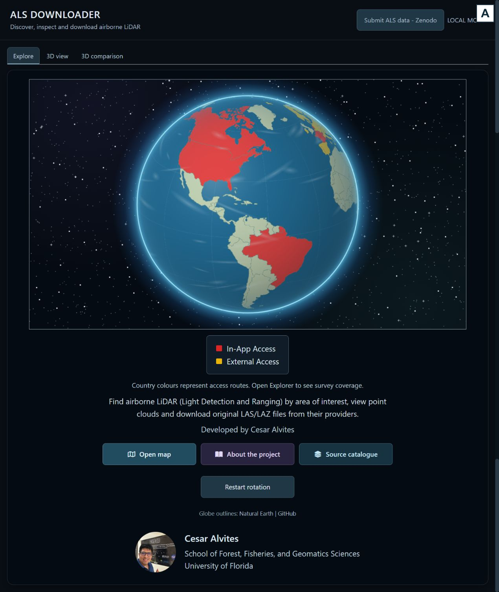
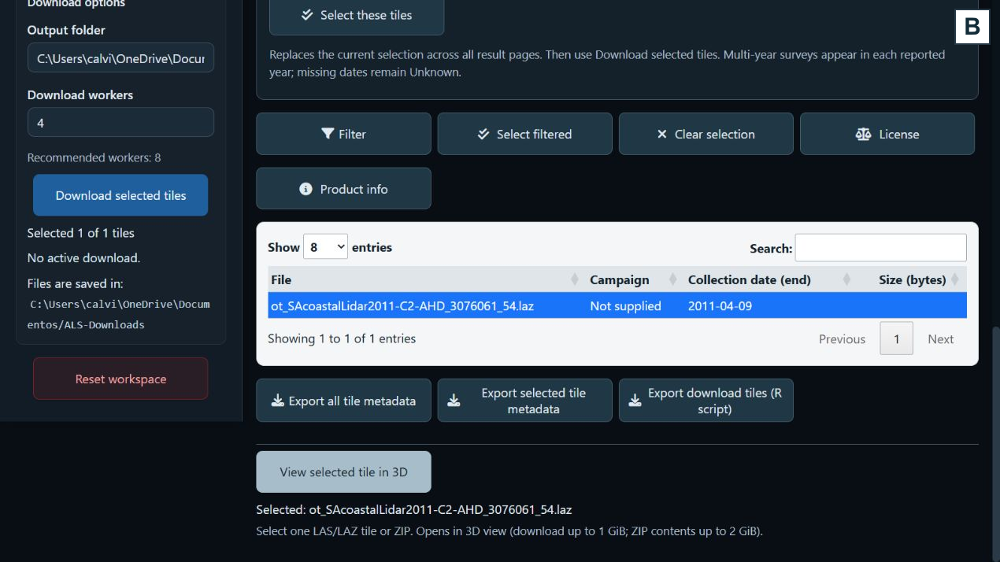
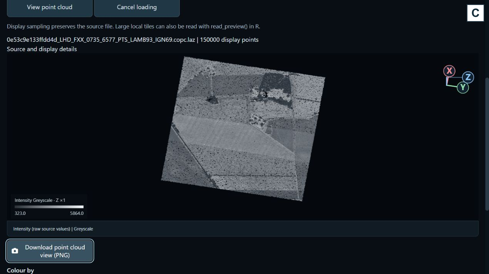
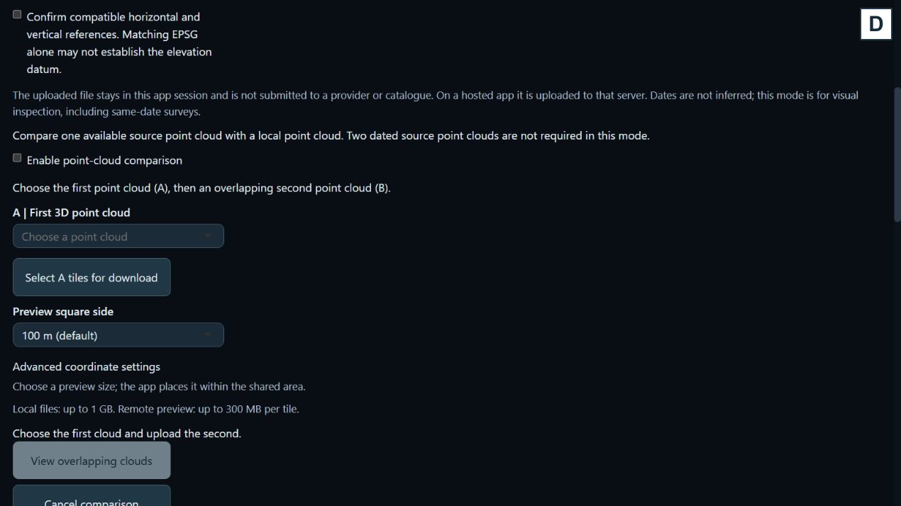

[](https://www.gnu.org/licenses/gpl-3.0)
[](NEWS.md)
[](#get-started)
[](https://cesarito2021.r-universe.dev/alsdownloader)
[](https://github.com/Cesarito2021/als_downloader/releases)
[](https://github.com/Cesarito2021/als_downloader/archive/refs/heads/main.zip)

# ALS Downloader: a web-based Shiny application for the discovery, management, visualization, and download of airborne laser scanning (ALS) datasets worldwide

**Developed by Cesar Alvites**<br>
School of Forest, Fisheries, and Geomatics Sciences, University of Florida

ALS Downloader links a user-defined area of interest (AOI) to available airborne LiDAR surveys. Users can identify and select tiles, download the original point cloud files in parallel, inspect point clouds interactively, and compare overlapping acquisitions. All data remain hosted by the originating providers. The catalogue combines direct data access with links to national portals, and spatial coverage varies by source.

## User interface

Start with the globe, then open **Explore** to find tiles. **3D view** inspects a
selected tile or local file; **3D comparison** brings overlapping clouds together.



**A.** The globe shows worldwide access routes and opens the dataset explorer.

## Get started

Install the latest published version from **[R-universe](https://cesarito2021.r-universe.dev/alsdownloader)** (recommended). Version **0.1.3** is prepared for final user review; the package has **not yet been submitted to CRAN**.

```r
install.packages("alsdownloader", repos = c(
  "https://cesarito2021.r-universe.dev",
  "https://cloud.r-project.org"
))
install.packages("lidR")
alsdownloader::launch_app()
```

Alternatively, install the development source from GitHub:

```r
install.packages(c("remotes", "lidR"))
remotes::install_github("Cesarito2021/als_downloader")
alsdownloader::launch_app()
```

Requires R ≥ 4.1. `lidR` enables point-cloud reading. PDF reports also require `rmarkdown`, Pandoc and a LaTeX installation such as TinyTeX. The GitHub ZIP contains software source, not LiDAR files. [Installation and workflow guide](vignettes/als-workflow.Rmd).

The R package is named **`alsdownloader`**. The repository remains `als_downloader` to preserve existing links.

## Coverage in numbers

ALS Downloader connects users to **USGS 3DEP, OpenTopography, CanElevation,
AHN6, swissSURFACE3D and IGN LiDAR HD**, with additional national portals in its
catalogue. **The verified OpenTopography integration alone provides access to
428 airborne-LiDAR collections, over 1.05 million unique point-cloud files and
42.6 TB of provider-hosted data.** The app discovers and downloads original files;
it does not store or redistribute these point clouds.

| OpenTopography snapshot · 20 September 2026 | Verified count |
|---|---:|
| Integrated airborne-LiDAR collections / survey footprints | 428 |
| Tile-footprint records in their indexes | 1,056,156 |
| Unique file objects, after removing shared-file duplicates | 1,056,011 |
| Original-file storage, from public object sizes | 42.598 TB (38.743 TiB) |

These figures exclude external-only collections and federated 3DEP. They are
not a combined global total or unique land area: different surveys can overlap.
Other provider inventories remain separate to avoid double counting.
[Methods and source inventories](docs/COVERAGE_STATISTICS.md) ·
[Per-collection statistics (CSV)](inst/extdata/opentopography-collection-statistics.csv).

**Core-aware parallel downloading** supports local workflows, bounded by available
CPU cores, selected jobs and provider limits (two simultaneous transfers by
default; hosted mode uses one). Downloaded LAS/LAZ files can then be processed
with tools such as `lidR`; the app provides sampled visualization and comparison.

## Explore, inspect and compare

<details>
<summary><strong>View the other interface panels (B–D)</strong></summary>

### Explorer → 3D view

Define an AOI, search acquisitions, select a year or campaign and download the
original files. **View selected tile in 3D** connects results directly to the
viewer. You can also open a local LAS/LAZ file.



**B.** Explorer displays tiles within the AOI, with acquisition filters, file selection and download tools.



**C.** The 3D viewer displays a selected tile or local point cloud, with orientation axes and colour controls.

### 3D comparison

Compare compatible source surveys, or a source with a local cloud, within their
overlap. Views use sampled points; comparison is visual and does not calculate
canopy-height change. Coordinate and elevation references must be compatible.



**D.** The comparison panel selects overlapping point clouds for synchronized views. This screenshot shows the setup controls.

</details>

## Outputs

* **Point clouds:** original LAS/LAZ files or provider ZIP archives.
* **Figures (PNG):** AOI and tile maps, point-cloud views, and available comparison profiles and distributions.
* **Metadata and scripts:** tile metadata (CSV) and an R script to download the selected files.
* **Download report (PDF):** a concise summary of the AOI, selected tiles, acquisition dates, known download volume (GiB), available figures and source credits.

**Review the PDF before downloading** to plan storage and document the selection.
Unknown file sizes are flagged; allow additional space for archive extraction
and temporary visualization files.

## Four source examples

Four verified sites shown as **top-down point clouds**. Point colours use **Viridis by source elevation (Z)**, not canopy
height or change. Click an image for the full-size view.
[Source credits and figure details](docs/README_FIGURES.md).

### 1. USA · Utah

USGS 3DEP · [Source catalogue](https://planetarycomputer.microsoft.com/dataset/3dep-lidar-copc).


### 2. Brazil · São Paulo

Municipality of São Paulo, SMDU/M3DC · [OpenTopography dataset](https://doi.org/10.5069/G9NV9GD1).


### 3. Canada · Athabasca

Natural Resources Canada · [CanElevation](https://open.canada.ca/data/en/dataset/7069387e-9986-4297-9f55-0288e9676947), Open Government Licence – Canada.


### 4. Netherlands · Groningen

AHN6 · [AHN](https://www.ahn.nl/dataroom), [CC BY 4.0](https://creativecommons.org/licenses/by/4.0/).


These are sampled visualizations of individual sites. Unknown coordinate units remain unverified;
no height normalization or change analysis is applied.

## ALS catalogue

| Integrated source | Access |
|---|---|
| **USGS 3DEP**, USA | Planetary Computer spatial catalogue and COPC files |
| **OpenTopography**, international | Audited hosted ALS catalogue; original tile indexes load automatically for the AOI |
| **CanElevation**, Canada | Official spatial tile service and original point clouds |
| **AHN6**, Netherlands | Spatial index and LAZ files |
| **swissSURFACE3D**, Switzerland | Spatial catalogue and LAS archives |
| **IGN LiDAR HD**, France | Spatial catalogue and COPC files |
| **Approved community sources** | Reviewed boundaries linked to provider-hosted files |

Additional catalogue entries link to providers' own portals. OpenTopography explicitly documents the [Tile Index download workflow](https://opentopography.org/node/3598) used by this adapter. Each source retains its own access conditions.

The package includes a small search index. Exact OpenTopography overview outlines
load on demand from a versioned, checksum-verified auxiliary catalogue (about
39 MB), cached for the R session. Tile searches always use the provider's original
polygons. [Incremental updates and catalogue versions](docs/OPENTOPOGRAPHY_ACCESS.md).

[Full source catalogue](inst/sources/SOURCES.md) · [Regional verification](docs/REGIONAL_VERIFICATION.md)

## Contribute ALS data

**Submit ALS data - Zenodo** accepts published Zenodo records. Supply the record link, coverage and acquisition information; Zenodo metadata provide authors, DOI, licence and available files. Polygons should link to the corresponding point-cloud assets. Declared approximate coverage remains labelled approximate.

The ALS Downloader team reviews submissions before publication. Inclusion requires explicit approval. Contributing a link does not transfer ownership or upload the point clouds to ALS Downloader.

Contributors need no account; their contact email is optional. An optional
[Formspree form](docs/FORMSPREE_SETUP.md) receives proposals from local or hosted
apps and notifies the maintainer. It requires a configured endpoint and is subject
to service quotas. Receipt is not approval or automatic catalogue publication.
The separate local queue supports [private email review invitations](docs/REVIEWER_ACCESS.md)
when its mail service is configured.

For Zenodo, select a supplied boundary and its matching cloud file, or upload
coverage polygons. Approved coverage updates in Explorer automatically.
[A real ALS and Shapefile integration test](docs/ZENODO_LIVE_CHECKS.md) documents
what was verified and the limits of automatic metadata extraction.

[Contribution guide](docs/CONTRIBUTING_DATA.md) · [Contact-data handling](docs/CONTRIBUTOR_PRIVACY.md)

## Author and citation

[Contact Cesar Alvites](mailto:calvites1990@gmail.com).

Use `citation("alsdownloader")` to cite the software. Cite each dataset's producer and DOI separately; exported metadata and reports preserve available source credits.

## Licences and credits

Software: **GPL-3**. Dataset rights remain with their respective rights holders. Access through this application grants no additional permission and implies no provider endorsement. Follow each dataset's licence, citation requirements and service conditions.

Leaflet and its R interface retain their software licences; Natural Earth supplies public-domain globe outlines. Explorer uses OpenStreetMap cartography with visible attribution. Exported maps retain the copyright URL. Browser caching and the [tile service policy](https://operations.osmfoundation.org/policies/tiles/) apply; no offline basemap downloads are provided.

[Third-party software notices](inst/NOTICE).

## Acknowledgements

Developed at the **University of Florida** within [OpenForest4D](https://openforest4d.org),
funded by the **U.S. National Science Foundation** (awards **2409885, 2409886 and 2409887**).

<table>
<tr>
<td align="center" width="25%"></td>
<td align="center" width="25%"></td>
<td align="center" width="50%"></td>
</tr>
</table>
