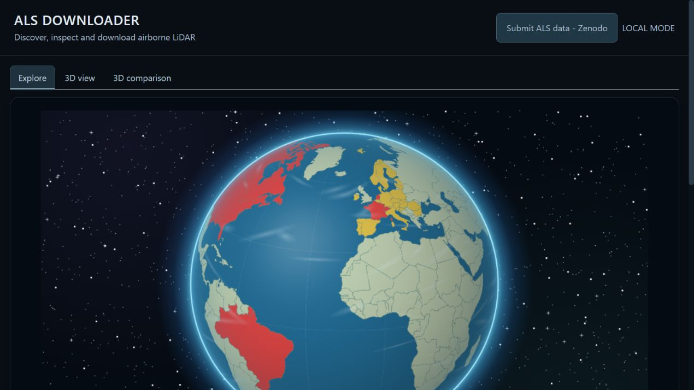
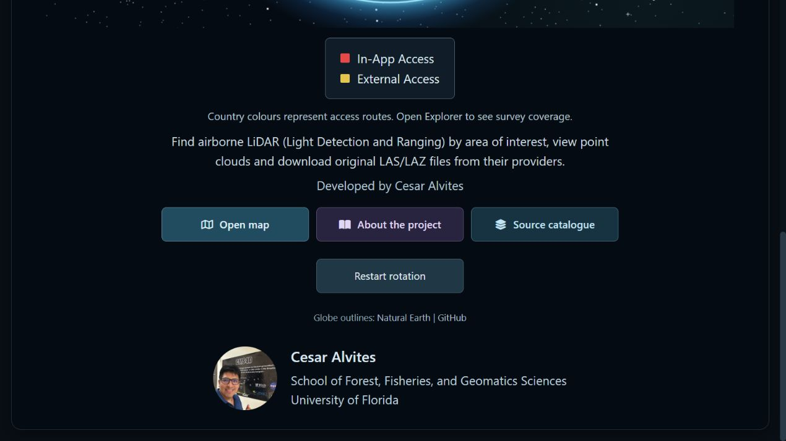
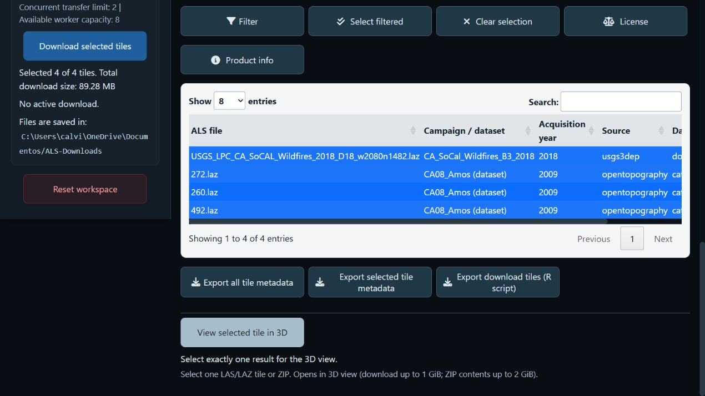
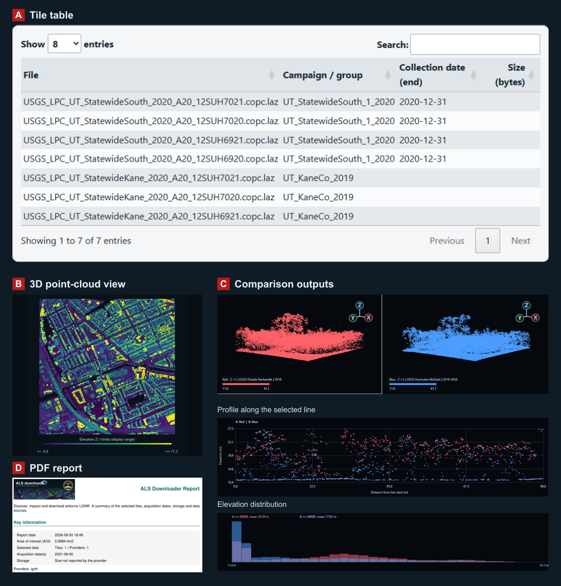
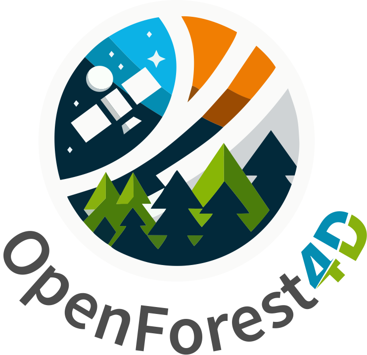
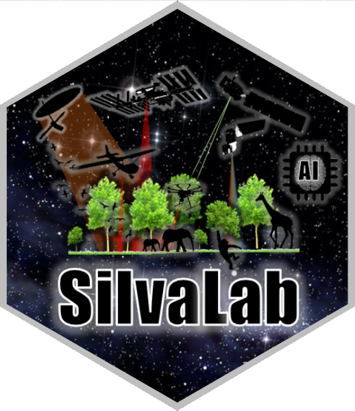

[](https://www.gnu.org/licenses/gpl-3.0)
[](NEWS.md)
[](#get-started)
[](https://cesarito2021.r-universe.dev/ALSdownloadeR)
[](https://github.com/Cesarito2021/als_downloader/releases)
[](https://github.com/Cesarito2021/als_downloader/archive/refs/heads/main.zip)

### ALS Downloader: a web-based Shiny application for the discovery, management, visualization, and download of airborne laser scanning (ALS) datasets worldwide

**Developed by Cesar Alvites**<br>
School of Forest, Fisheries, and Geomatics Sciences, University of Florida

ALS Downloader links a user-defined area of interest (AOI) to available airborne LiDAR surveys. Users can identify and select tiles, download the original point cloud files in parallel, inspect point clouds interactively, and compare overlapping acquisitions. All data remain hosted by the originating providers. The catalogue combines direct data access with links to national portals, and spatial coverage varies by source.

## User interface

Start with the globe, then open **Explore** to find tiles. **3D view** inspects a
selected tile or local file; **3D comparison** brings overlapping clouds together.



The globe shows access routes: red indicates in-app ALS data access and yellow indicates external portals; survey coverage varies within each country. Open map launches the dataset explorer. Submit ALS data opens the Zenodo contribution form.



### Explorer



Define an AOI, set the acquisition period and click Find ALS data. Select years and campaigns, inspect source evidence with Product info, and export metadata or a report. This real example contains a documented 2018 USGS project and an independent OpenTopography survey ending in 2009; the selected original files total 89.28 MB.

## Get started

The development package is now named **ALSdownloadeR**. The previous CRAN submission was cancelled; this revised version has not been submitted or published. Install a locally built source archive during review. The R-universe instructions below apply after the renamed package has been published there.

```r
install.packages("ALSdownloadeR", repos = c(
  "https://cesarito2021.r-universe.dev",
  "https://cloud.r-project.org"
))
install.packages("lidR")
ALSdownloadeR::launch_app()
```

The browser is the interface; R runs the application on your computer. To start explicitly in local mode:

```r
ALSdownloadeR::launch_app(mode = "local")
```

Local mode saves files to your chosen folder and supports parallel transfers. The effective worker count is limited by available cores (reserving four when possible), selected tiles and the configured transfer limit (two by default). A public server running in `hosted` mode uses one worker. Where a provider permits more connections, configure the limit when launching, for example `launch_app(mode = "local", provider_limit = 4L)`.

Alternatively, install the development source from GitHub:

```r
install.packages(c("remotes", "lidR"))
remotes::install_github("Cesarito2021/als_downloader")
ALSdownloadeR::launch_app()
```

Requires R ≥ 4.1. `lidR` enables point-cloud reading. PDF reports also require `rmarkdown`, Pandoc and a LaTeX installation such as TinyTeX. The GitHub ZIP contains software source, not LiDAR files. [Installation and workflow guide](vignettes/als-workflow.Rmd).

The R package is named **`ALSdownloadeR`**. The repository remains `als_downloader` to preserve existing links.

## ALS Data Catalog

| Integrated source | Access |
|---|---|
| **USGS 3DEP**, USA | Official USGS The National Map catalogue and original LAZ files |
| **OpenTopography**, international | Audited hosted ALS catalogue; original tile indexes load automatically for the AOI |
| **CanElevation**, Canada | Official spatial tile service and original point clouds |
| **AHN6**, Netherlands | Spatial index and LAZ files |
| **swissSURFACE3D**, Switzerland | Spatial catalogue and LAS archives |
| **IGN LiDAR HD**, France | Spatial catalogue and COPC files |
| **Approved community sources** | Reviewed boundaries linked to provider-hosted files |

Other countries link to their official download portals. [Full source catalogue](inst/sources/SOURCES.md).

## ALS Downloader Stats

The audited OpenTopography portion of ALS Downloader connects users to over **1.05 million files (42.6 TB)** hosted by the original providers.

| OpenTopography snapshot · 20 September 2026 | Verified count |
|---|---:|
| Integrated airborne-LiDAR collections / survey footprints | 428 |
| Tile-footprint records in their indexes | 1,056,156 |
| Unique file objects, after removing shared-file duplicates | 1,056,011 |
| Original-file storage, from public object sizes | 42.598 TB (38.743 TiB) |

Counts cover the audited OpenTopography collections, excluding federated 3DEP and external-only entries. [Inventory and methods](https://github.com/Cesarito2021/als_downloader/blob/main/docs/COVERAGE_STATISTICS.md).

## Input data

- **Study area:** draw a polygon or rectangle, or upload an AOI file.
- **Acquisition period:** choose dates, then select tiles by year and campaign or directly in the table.
- **Download folder and workers:** choose where to save files and how many transfers to run in parallel.
- **Local point cloud (optional):** open a LAS/LAZ file for 3D viewing or comparison.

## Outputs

**Download ALS data** downloads the selected files directly from the app; no R script is required. In local mode, files go to your chosen folder. In hosted mode, the download is delivered through the browser.

**Optional: download with R** contains **Download R script**. Use it to take a selection from the app (including a hosted session) and download it later on your own computer in R/RStudio. The script includes the selected source records, short comments, an editable output folder and parallel-transfer settings. Once exported, it runs independently of the app. `workers` requests simultaneous downloads; available cores and `provider_limit` cap the actual concurrency.

Attaching the package with `library(ALSdownloadeR)` displays this greeting and suggested citation. The exported R script includes the same text as comments above the download instructions.

```text
##----------------------------------------------------------------##
##                         ALSdownloadeR                           ##
##----------------------------------------------------------------##
An R package with a web-based Shiny app for airborne laser scanning data.
Our mission is to make ALS data more accessible for research.
Discover, visualize and download point clouds from multiple sources.
Access acquisition information and prepare reproducible download scripts.
Developed by César Alvites at the University of Florida.
Thank you for using ALSdownloadeR.
##---------------------- Suggested citation -----------------------##
Alvites, C. (2026). ALS Downloader: a web-based Shiny application
for the discovery, management, visualization, and download of
airborne laser scanning (ALS) datasets worldwide.
Manuscript in preparation.
For the software reference, use citation("ALSdownloadeR").
Please also cite the original datasets used in your research.
##----------------------------------------------------------------##
```

* **Point clouds:** original LAS/LAZ files or provider ZIP archives.
* **Figures (PNG):** AOI and tile maps, point-cloud views, and available comparison profiles and distributions.
* **Metadata and scripts:** tile metadata (CSV) and an R script to download the selected files.
* **Download report (PDF):** a concise summary of the AOI, selected tiles, acquisition dates, reported download size (MB or GB), available figures and source credits.

**Recommendation:** review the PDF before downloading to check the selected tiles and reported storage requirements. File sizes may be unavailable from some providers.



**A.** Tile table (USGS, Utah). **B.** Point-cloud view (AHN6, Groningen). **C.** Overlapping USGS acquisitions in Apalachicola, with a profile and elevation histogram. **D.** PDF report excerpt (IGN France). Panels show separate real examples. [Sources and figure preparation](https://github.com/Cesarito2021/als_downloader/blob/main/docs/README_FIGURES.md).

## Point-cloud examples

Four source datasets viewed from above and coloured by elevation. Click an image to enlarge it. [Figure credits](https://github.com/Cesarito2021/als_downloader/blob/main/docs/README_FIGURES.md).

### 1. USA · Utah

USGS 3DEP · [Source catalogue](https://planetarycomputer.microsoft.com/dataset/3dep-lidar-copc).


### 2. Brazil · São Paulo

Municipality of São Paulo, SMDU/M3DC · [OpenTopography dataset](https://doi.org/10.5069/G9NV9GD1).


### 3. Canada · Athabasca

Natural Resources Canada · [CanElevation](https://open.canada.ca/data/en/dataset/7069387e-9986-4297-9f55-0288e9676947), Open Government Licence – Canada.


### 4. Netherlands · Groningen

AHN6 · [AHN](https://www.ahn.nl/dataroom), [CC BY 4.0](https://creativecommons.org/licenses/by/4.0/).


## Share your ALS data

Share an ALS dataset already published on **Zenodo** through **Submit ALS data - Zenodo**:

1. Enter the Zenodo record or DOI and supply its coverage polygons.
2. Match the polygon IDs to the point-cloud files, choose acquisition years and provide a private contact email.
3. Validate and submit. The team reviews the entry before it appears in the catalogue.

Data remain on Zenodo. Catalogue entries retain the dataset DOI, authors and licence so users can find and cite your work. We encourage citation of both the dataset and its associated paper; users are responsible for respecting the source licence and attribution requirements.

## Author and contact

**César Alvites** · University of Florida · [calvites1990@gmail.com](mailto:calvites1990@gmail.com)

## Related publications

- Alvites, C., Santopuoli, G., Maesano, M., Chirici, G., Moresi, F. V., Tognetti, R., Marchetti, M., & Lasserre, B. (2021). [Unsupervised algorithms to detect single trees in a mixed-species and multilayered Mediterranean forest using LiDAR data](https://flore.unifi.it/handle/2158/1259181). *Canadian Journal of Forest Research, 51*(12), 1766–1780.
- Alvites, C., Marchetti, M., Lasserre, B., & Santopuoli, G. (2022). [LiDAR as a tool for assessing timber assortments: A systematic literature review](https://doi.org/10.3390/rs14184466). *Remote Sensing, 14*(18), 4466.
- Alvites, C. (2026). *ALS Downloader: a web-based Shiny application for the discovery, management, visualization, and download of airborne laser scanning (ALS) datasets worldwide*. **Manuscript in preparation.**

## Acknowledgements

Developed at the **University of Florida** within [OpenForest4D](https://openforest4d.org),
funded by the **U.S. National Science Foundation** (awards **2409885, 2409886 and 2409887**).

Any opinions, findings and conclusions or recommendations expressed in this material are those of the author(s) and do not necessarily reflect the views of the National Science Foundation.

<table>
<tr>
<td align="center" width="20%"></td>
<td align="center" width="20%"></td>
<td align="center" width="40%"></td>
<td align="center" width="20%"></td>
</tr>
</table>

## Licensing and credits

Software: **GPL-3**. Source datasets retain their own licences and citation requirements. Maps credit OpenStreetMap and Natural Earth; acknowledgement logos belong to their respective organizations. [Third-party notices](inst/NOTICE).


### Acquisition metadata and download planning

Use `find_als_data()` to search original USGS 3DEP products and the supported providers. `planetary` is an explicit optional COPC mirror, not the USGS inventory. The established `find_tiles()` name remains available for existing scripts. `Acquisition year` reports the final acquisition year when documented; filename references are explicitly labelled. `NA` means no usable value is available in the checked sources. Retrieval failures and unverified references are retained in the evidence fields. Follow the linked source records and metadata before choosing a temporal comparison.

The app allows users to visualize point clouds. Clicking **View selected tile in 3D** temporarily downloads the selected file and displays a preview. For comparison, **View overlapping clouds** temporarily downloads the selected remote files and displays their shared area; uploaded local files are read directly. Selecting a pair alone does not download the clouds. Either member of a valid temporal pair can be selected first; the second menu lists only its compatible overlapping partners. The default coverage requirement is 99% of the smaller tile, with a positive shared area inside the AOI.

`get_als_file_sizes()` retrieves missing sizes using bounded HTTP requests. `summarize_als_download()` reports the aggregate for a selection. The report distinguishes a complete **total download size** from a known subtotal with missing sizes. GB means 10^9 bytes; download size does not include extra space required to decompress or process files. Search time depends on the number of records and provider response times; unfinished size lookups remain explicit.
