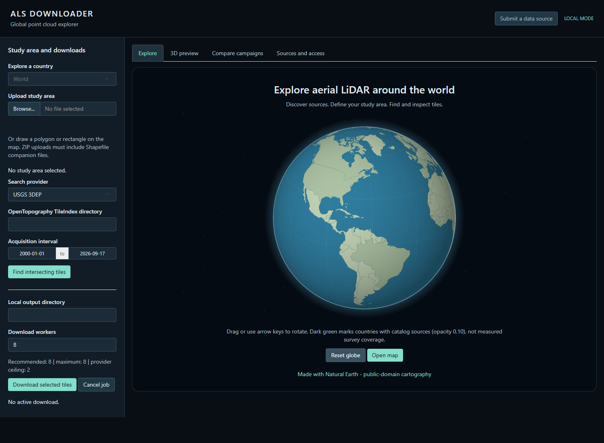
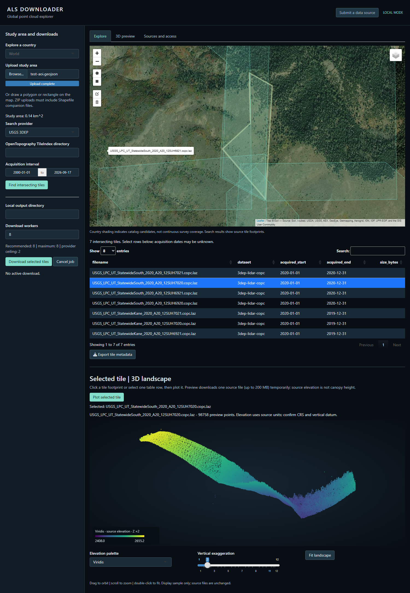
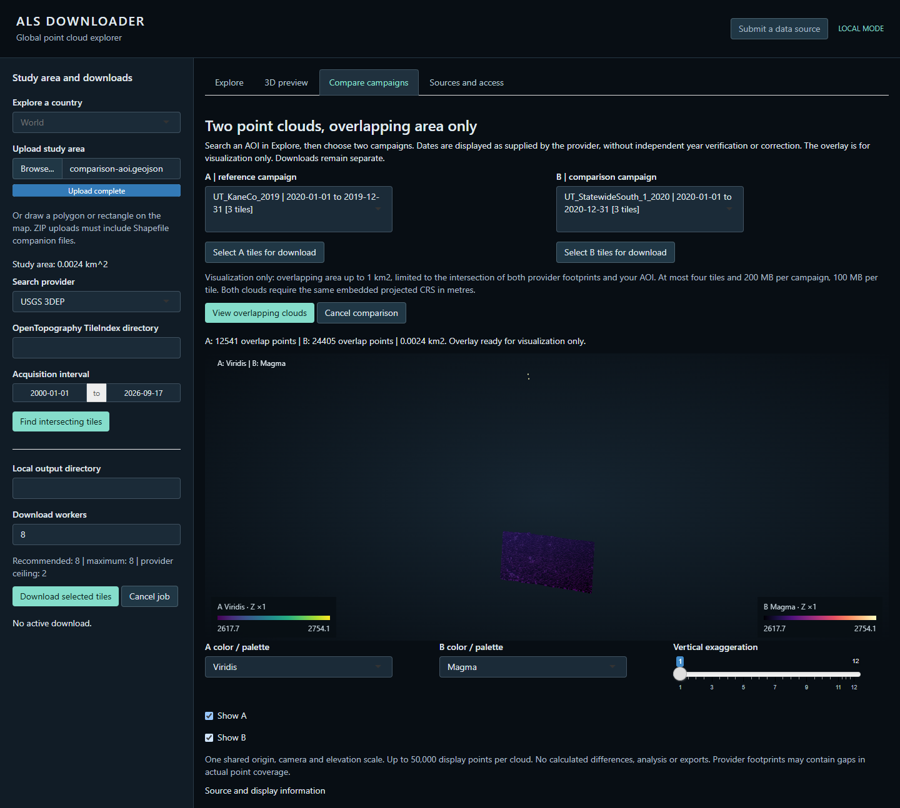

# ALS Downloader

**Discover, inspect and download airborne LiDAR.** ALS Downloader is open-source software for the scientific community and stakeholders, connecting users to aerial laser-scanning point clouds from multiple providers. Once the app is launched and its sources configured, explore the map, draw or upload a study area, inspect acquisition dates and tiles, and download original files **without writing code**. Optional 3D previews support visual inspection. **Parallel downloads in local mode** respect the configured provider limits; hosted transfers run one at a time.

| Access snapshot | Current scope |
|---|---|
| Countries with a successful connected-source access sample | **6**: United States, Netherlands, Switzerland, Brazil, New Zealand (17 September 2026) and France (18 September 2026). France's STAC endpoint and file host were verified live on 17 September 2026 (see [VALIDATION.md](inst/sources/VALIDATION.md)); the in-app adapter built from that evidence has not yet been re-tested against the live service in a network-enabled session or CI run. This does not imply complete national coverage. |
| Collection years | Provider-reported dates appear with search results; missing dates remain unknown. A complete global year range has not been established. |
| Approximate data volume | Known file sizes are totalled for the selected tiles; files with unknown sizes are identified separately. A global GB total has not been established. |

The software is open source; each external dataset retains its own licence and attribution requirements.

Integrated workflows cover **USGS 3DEP, AHN6, swissSURFACE3D, IGN LiDAR HD (France), OpenTopography tile indexes and approved contributor GeoJSON indexes**. The catalogue also links to additional sources, with their integration status clearly identified. Covers aircraft, helicopter and UAV laser scanning.

Developed and maintained by **Cesar Alvites**. Release candidate **0.1.0**; not yet submitted to CRAN.

## Install and launch

```r
install.packages("remotes")
remotes::install_github("Cesarito2021/als_downloader")
alsdownloader::launch_app()
```

Requires R >= 4.1. Install `lidR` for optional point-cloud previews. USGS, AHN6, swissSURFACE3D and IGN LiDAR HD (France) query online spatial catalogues. OpenTopography and contributed sources use locally configured tile indexes; remote downloads require internet access. See the [workflow guide](vignettes/als-workflow.Rmd).

## 1. Explore sources



Screenshots illustrate the interface before the latest source exclusions, colour update and the two-panel comparison layout; the [complete source table](inst/sources/SOURCES.md) records the current catalogue.

| Control | Purpose |
|---|---|
| W1 - Globe | Rotate to explore countries represented in the active catalog. |
| W2 - Red shading | Country has an in-app search-and-download adapter. Not complete national survey coverage. |
| W3 - Yellow shading | Country has only a linked official source; download from the provider's own portal. |
| W4 - Open map | Open the map to draw or upload an area of interest. |

## 2. Search, download and plot



| Control | Purpose |
|---|---|
| A - Header | Application and local/hosted mode. |
| B - Study area | Draw a polygon/rectangle or upload GeoJSON, GeoPackage or a zipped Shapefile. |
| C - Search | Select a provider and acquisition interval; find intersecting tiles. |
| D - Download | Select files and download originals to your chosen folder. |
| E - Map | Inspect the study area and returned tile footprints. |
| F - Results | Review metadata; select one tile and click **Plot selected tile in 3D**. |

The search figure is a Utah example. Collection dates come from provider acquisition metadata; the **final collection date** represents an interval. Missing dates remain unknown. Publication dates and filename years are not substituted. Source imagery may have a different date from the LiDAR.

The OpenTopography adapter follows the tile-index selection and download workflow described in OpenTopography's official tutorial, [*Programmatic Access to OpenTopography's Point Cloud Data with Tile Indexes*](https://opentopography.org/node/3598) (24 November 2025): intersect supplied tile indexes with the study area and download the selected original LAS/LAZ files.

## 3. Compare campaigns and view a profile



Choose two campaigns covering the same AOI and opt into **Compare campaigns**. View a shared window with a side of 100 m to 1 km, shown as **two side-by-side panels** (A left, B right) sharing one camera: rotate or zoom either panel and both move together. The default colours are light purple (A) and pale yellow (B) on black; red and blue are also available.

Click **Draw profile line** to switch both panels to a top-down view together, then click two endpoints (in either panel) or drag a segment in any direction; the same line appears in both automatically. A single profile of both sampled clouds appears below, using their colours and original elevations. Adjust the strip width, show/hide either campaign, return to 3D, or download the cloud, profile or both as PNG.

The profile does not require height normalization. Both clouds must have compatible coordinate references; the app does not align them, fit curves or calculate changes. [Visual comparison guide](docs/TEMPORAL_COMPARISON.md).

## Source examples

Eight examples are shown below. The **[complete catalogue, access conditions and credits](inst/sources/README.md)** ships inside the package, together with a table of software dependencies. Portal references are distinguished from implemented downloads. Two entries reviewed earlier (OpenTopography AUS11_Victor, Australia and PNOA LiDAR, Spain) were removed from the catalogue: Australia's dataset carries no supplied reuse licence, and Spain's official portal returned an HTTP 403 on the anonymous download-init check. See [Review evidence](docs/ACTIVE_SOURCES.md) for both records.

| Source / product | Official resource | Available workflow |
|---|---|---|
| USGS 3DEP | [USGS via Planetary Computer](https://planetarycomputer.microsoft.com/dataset/3dep-lidar-copc) | AOI search, original download, bounded preview. |
| OpenTopography index service | [OpenTopography](https://opentopography.org/node/3598) | Local TileIndex files; dataset-specific access and terms. |
| BR17_SaoPaulo, Brazil | [OpenTopography catalog](https://portal.opentopography.org/datasets) | Index adapter; representative LAS/LAZ access checked. |
| Auckland_2013, New Zealand | [OpenTopography catalog](https://portal.opentopography.org/datasets) | Index adapter; representative LAS/LAZ access checked. |
| CanElevation, Canada | [Government of Canada](https://open.canada.ca/data/en/dataset/7069387e-9986-4297-9f55-0288e9676947) | Source link; representative COPC access checked; no AOI adapter. |
| IGN LiDAR HD, France | [Official record](https://cartes.gouv.fr/rechercher-une-donnee/dataset/IGNF_NUAGES-DE-POINTS-LIDAR-HD) | AOI search via a public STAC catalogue (UMR TETIS / INRAE, not IGN's own WFS), original COPC LAZ download; adapter added 18 September 2026, pending a fresh live/CI validation. |
| AHN6, Netherlands | [AHN](https://www.ahn.nl/dataroom) | Native footprint search and original LAZ download; AHN6 only. |
| swissSURFACE3D, Switzerland | [swisstopo](https://www.swisstopo.admin.ch/en/height-model-swisssurface3d) | Native AOI search and original LAS ZIP downloads; extract locally for preview. |

Only aircraft, helicopter and UAV **laser scanning** are in scope. Automatic integration requires open-licensed, anonymous access, spatial coverage metadata and preserved provider attribution. The app downloads original files from their providers and does not host point clouds or bypass access restrictions. [Review evidence](docs/ACTIVE_SOURCES.md) · [European candidates](docs/EUROPE_ACCESS_REVIEW.md).

In R, use `alsdownloader::provider_catalog()` for the full table, or locate the installed guide with `system.file("sources", "README.md", package = "alsdownloader")`.

## Submit your dataset

Ten main fields: dataset name, **contact email**, description (up to **50 words**), dataset DOI or Zenodo record ID, collection year(s), aerial platform, LAS/LAZ or index link, license link, access requirements and optional sensor/location notes. Zenodo submissions additionally require a polygon boundary link, unless the data link already supplies the GeoJSON tile index.

Keep the point clouds in their original repository. For **discover → inspect → download**, submit a small GeoJSON index with one footprint and direct LAS/LAZ link per tile. Approved indexes support AOI search without a new provider-specific connector. [Template, required fields and large-file guidance](docs/CONTRIBUTING_DATA.md).

Complete the form, click **Check compatibility**, then **Submit your request** when the vector alligator reaches 100%. The check reads LAS/LAZ headers or up to 5 MiB of GeoJSON metadata; no point cloud is downloaded or plotted. Completion means technical checks passed, not publication approval. A successful check enables a private email draft to the maintainer. Review and send it in your email application. Editing the request resets compatibility. Portals and authentication-based access need manual discussion.

After an AOI search, select tiles to see their known total size, export selected metadata or download an R script for local transfer. Downloads preserve complete original tiles; they do not clip files to the AOI. A metadata index does not make a large point-cloud file smaller, and 3D inspection remains optional.

Your contact email is for review and acceptance replies and is not included in public GitHub issues. Inclusion requires maintainer approval. No automatic email delivery service is configured. [Contact handling and acceptance reply](docs/CONTRIBUTOR_PRIVACY.md). [Observed approval times](docs/APPROVAL_TIMES.md) count only public metadata-only GitHub requests marked `source-approved`; private email requests are excluded.

## Contact and citation

**Cesar Alvites — developer and maintainer:** [calvites1990@gmail.com](mailto:calvites1990@gmail.com). Report reproducible software problems through [GitHub Issues](https://github.com/Cesarito2021/als_downloader/issues). Cite the package with `citation("alsdownloader")` and cite each dataset's DOI and producer separately.

## Acknowledgement

Developed within [OpenForest4D](https://openforest4d.org), funded by NSF awards **2409885, 2409886 and 2409887**.

## License and disclaimer

ALS Downloader connects users to existing airborne LiDAR data held by external providers. Dataset rights remain with their respective rights holders. Users must follow each dataset's licence, attribution requirements and access conditions for their intended use, including commercial use and redistribution. Inclusion does not imply provider endorsement or grant additional permissions. See [source policies](inst/sources/POLICIES.md).

Software: **GPL-3**, without warranty. Source availability, spatial coverage and suitability are not guaranteed. Natural Earth supplies public-domain globe outlines; basemap credits remain visible. [Third-party notices](inst/NOTICE).

[Release checks and outstanding CRAN considerations](docs/CRAN_READINESS.md).
