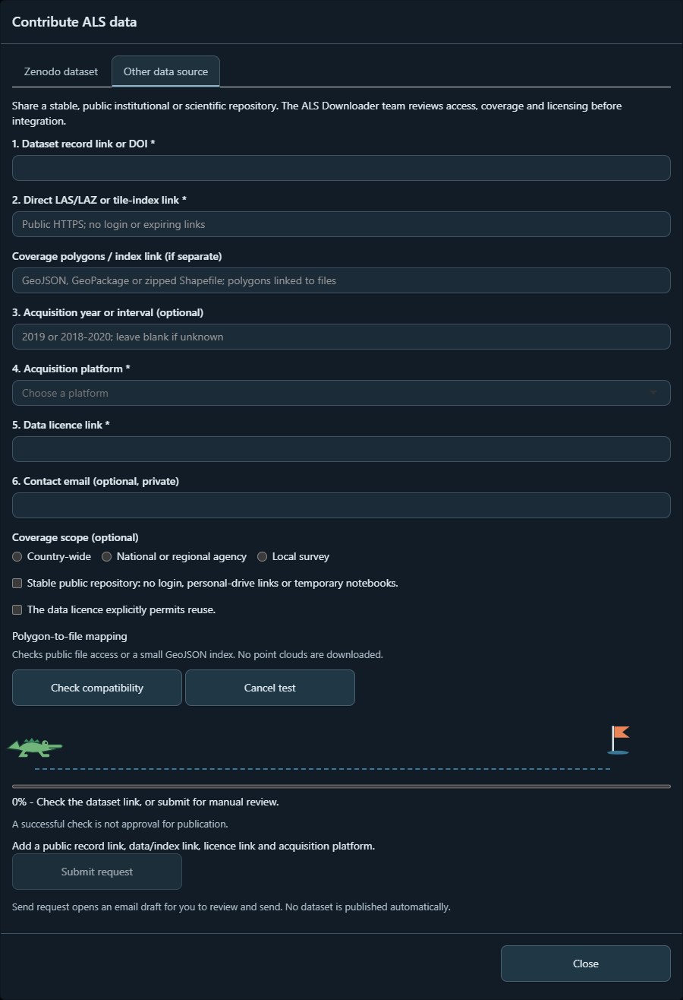
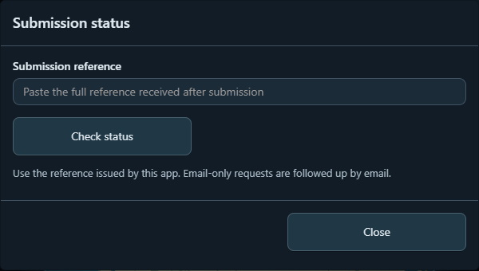
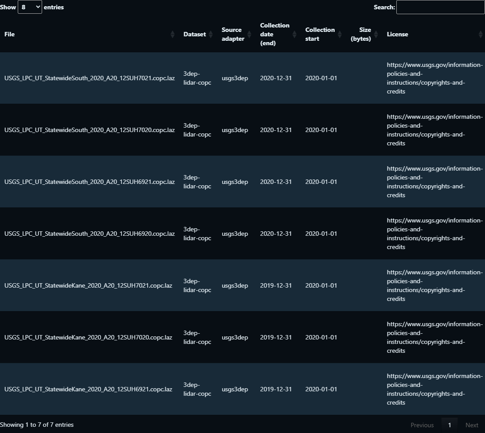
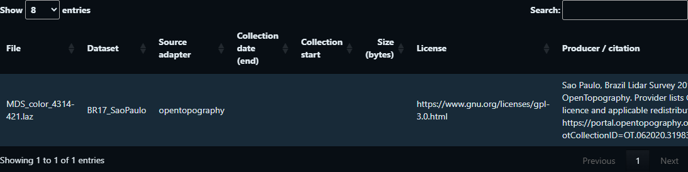
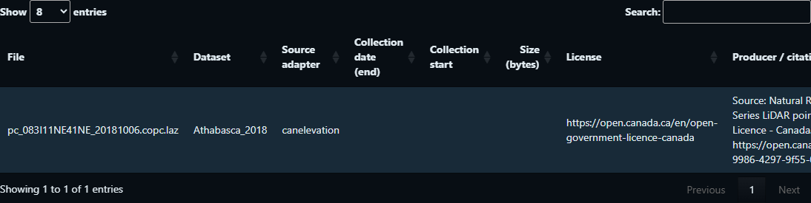
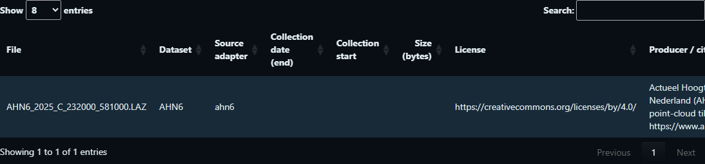

# ALS Downloader


[](https://www.gnu.org/licenses/gpl-3.0)
[](NEWS.md)

**Discover, visualize and download airborne laser scanning data from an international catalogue.**
ALS Downloader combines R functions with a map-based Shiny application: define an **area of interest (AOI)**, find available tiles, inspect point clouds and download original files from their providers. Coverage depends on the source and configured indexes; the catalogue does not imply complete global or national coverage.

[Get started](#get-started) · [Application](#application) · [Examples](#four-source-examples) · [Catalogue](#als-catalogue) · [Contribute](#contribute-als-data)

## Get started

Development version **0.1.0**; **not yet submitted to CRAN**. The GitHub repository is currently private. Installation from GitHub requires authorized access and configured GitHub authentication.

```r
install.packages(c("remotes", "lidR"))
remotes::install_github("Cesarito2021/als_downloader")
alsdownloader::launch_app()
```

Requires R ≥ 4.1. `lidR` enables point-cloud reading. PDF reports also require `rmarkdown`, Pandoc and a LaTeX installation such as TinyTeX. Some sources require administrator-configured spatial indexes. [Installation and workflow guide](vignettes/als-workflow.Rmd).

The R package is named **`alsdownloader`**. The repository remains `als_downloader` to preserve existing links.

## Application


| View | Purpose |
|---|---|
| **Explore** | Draw or upload an AOI, filter acquisition dates, inspect footprints and select tiles. |
| **3D view** | Inspect a source tile or local LAS/LAZ, using source classification, intensity or elevation colours. |
| **3D comparison** | Visually compare compatible sources or a source with a local cloud in a shared window. |
| **Download report (PDF)** | After a successful search, review tile counts, dates, known storage requirements, figures and credits before downloading. |

Downloads preserve original tiles. The viewer uses sampled points and may download files temporarily. Comparison is a visual aid, not an automated change estimate; compatible coordinate and elevation references are required. [Comparison guide](docs/TEMPORAL_COMPARISON.md).

<details>
<summary>View the application screens</summary>

**Explore and download planning**


**Point-cloud visualization**


**Comparison controls** — no comparison result is claimed in this capture.


**About the project**


**Source catalogue**


**Contribute ALS data**


**Other data sources**


**Submission status**


</details>

## Four source examples

Real search metadata and sampled source points from regional verification, displayed in the current interface. Each cloud is viewed from above. Maps currently show geometry only; the RGB versions await confirmation of imagery publication rights. These examples demonstrate access at specific sites, not complete country coverage. [Figure provenance and source credits](docs/README_FIGURES.md).

| Site | AOI and tile footprints | Point cloud: top-down | Tile metadata |
|---|---|---|---|
| **1. USA** — Utah, USGS 3DEP |  |  |  |
| **2. Brazil** — São Paulo |  |  |  |
| **3. Canada** — Athabasca |  |  |  |
| **4. Netherlands** — AHN6 |  |  |  |

## ALS catalogue

| Integrated source | Access |
|---|---|
| **USGS 3DEP**, USA | Planetary Computer spatial catalogue and COPC files |
| **OpenTopography**, international | Configured Tile Index files; includes selected São Paulo and Auckland datasets |
| **CanElevation**, Canada | Configured regional indexes and original point clouds |
| **AHN6**, Netherlands | Spatial index and LAZ files |
| **swissSURFACE3D**, Switzerland | Spatial catalogue and LAS archives |
| **IGN LiDAR HD**, France | Spatial catalogue and COPC files |
| **Approved community sources** | Reviewed boundaries linked to provider-hosted files |

Additional catalogue entries link to providers' own portals. OpenTopography explicitly documents the [Tile Index download workflow](https://opentopography.org/node/3598) used by this adapter. Each source retains its own access conditions.

[Full source catalogue](inst/sources/SOURCES.md) · [Regional verification](docs/REGIONAL_VERIFICATION.md)

## Contribute ALS data

**Contribute ALS data** accepts Zenodo records and other stable public scientific sources. Supply the record link, coverage and acquisition information; Zenodo metadata provide authors, DOI, licence and available files. Polygons should link to the corresponding point-cloud assets. Declared approximate coverage remains labelled approximate.

Submissions require maintainer approval before appearing in searches. **Submission status** tracks a proposal using its reference. Contributing a link does not transfer ownership or upload the point clouds to ALS Downloader.

[Contribution guide](docs/CONTRIBUTING_DATA.md) · [Contact-data handling](docs/CONTRIBUTOR_PRIVACY.md)

## Author and citation

Developed and maintained by **Cesar Ivan Alvites Diaz (Cesar Alvites)**, [University of Florida](https://cesarito2021.github.io/). [Contact](mailto:calvites1990@gmail.com).

Use `citation("alsdownloader")` to cite the software. Cite each dataset's producer and DOI separately; exported metadata and reports preserve available source credits.

## Acknowledgement

Developed within [OpenForest4D](https://openforest4d.org), funded by NSF awards **2409885, 2409886 and 2409887**.

## Licences and credits

Software: **GPL-3**. Dataset rights remain with their respective rights holders. Access through this application grants no additional permission and implies no provider endorsement. Follow each dataset's licence, citation requirements and service conditions.

Leaflet and its R interface retain their software licences; Natural Earth supplies public-domain globe outlines. Esri basemaps have separate service and imagery conditions. Map credits must remain visible in exported figures.

[Third-party notices](inst/NOTICE) · [Data and figure licensing](inst/sources/LICENSING.md) · [Access and intellectual-property review](inst/sources/USE_REVIEW.md) · [CRAN readiness](docs/CRAN_READINESS.md)
