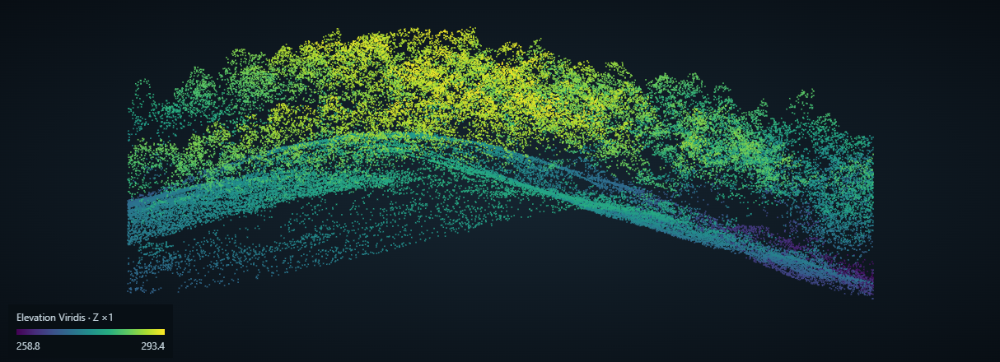
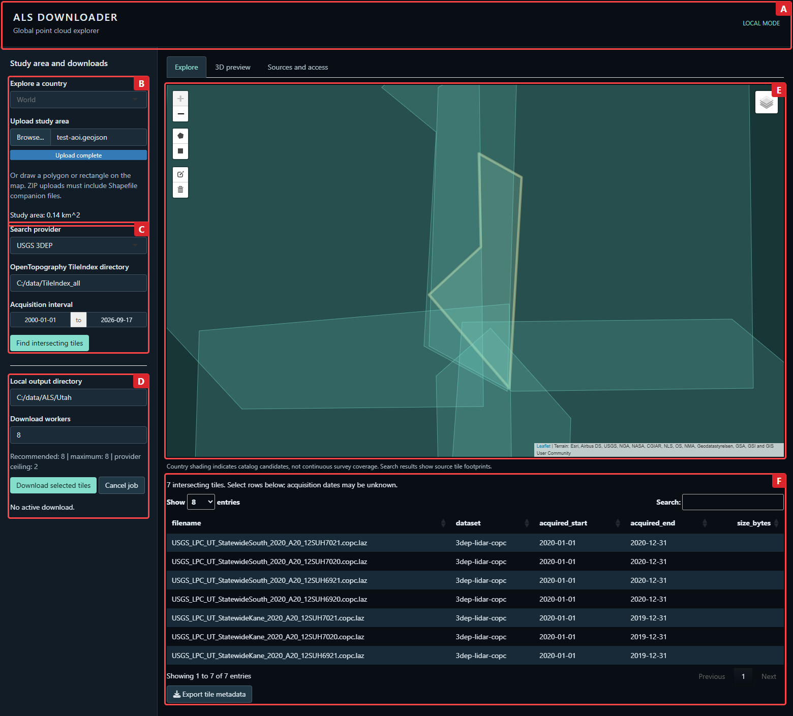
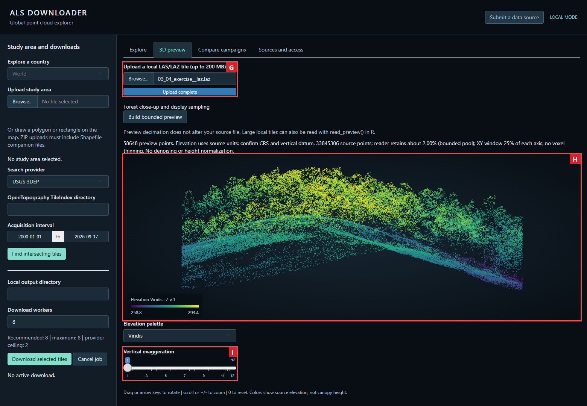
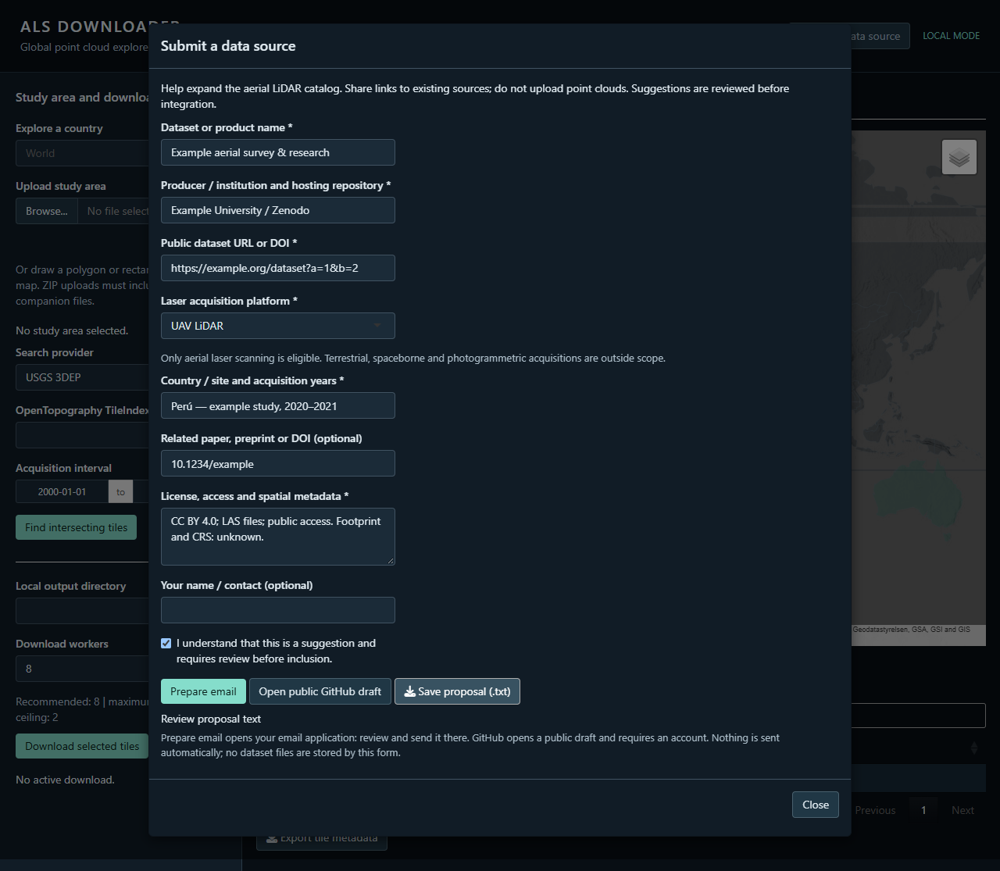

# ALS Downloader

**Discover airborne LiDAR, download source tiles, and inspect point clouds.**

An R package and Shiny application developed within [OpenForest4D](https://openforest4d.org).
Draw or upload a study area, search available surveys, select LAS/LAZ tiles and save them locally.

[Install](#install-and-launch) · [Interface guide](#user-interface) · [Data sources](#data-sources) · [Validation](docs/SOURCE_AUDIT.md) · [Report an issue](https://github.com/Cesarito2021/als_downloader/issues)

**Development preview 0.1.0.9001.** USGS 3DEP and local OpenTopography tile indexes are integrated.
Other sources are reviewed links for discovery; they do not yet have download adapters. Not submitted to CRAN.

## User interface

### A close-up of the forest canopy



This example uses the forest exercise file supplied with the maintainer's biomass application.
The reader retains approximately **2%** of its 33,845,306 records; a central window spanning **25% of each XY axis** shows **58,648 points**.
The camera is set to **Forest silhouette**, with vertical scale **1:1**. No denoising, terrain normalization or synthetic trees were applied.
It is a visualization example, not a newly verified geographic data source. [Capture settings](docs/images/forest-capture-provenance.json).

Open **Forest close-up and display sampling** in either preview workflow to change the reader percentage,
window size/position, optional voxel spacing, camera preset and point size. Rebuild after changing sampling or the window.
Camera and point-size changes are immediate. The bounded reader pool can reduce the requested percentage on very large files;
the status reports the effective sampling and the display contains at most 150,000 points.
Downloads and temporal-comparison calculations are unaffected by these display controls.

### Compare campaigns and download each separately

After an AOI search, open **Compare campaigns** and choose reference **A** and later **B**.
Superpose their AOI-clipped clouds with independent colors/palettes and show/hide controls.
After verifying compatible vertical references and acquisition intervals, inspect an exploratory
**P95 elevation difference, B − A**, on a shared grid; export the grid and its provenance.
Use **Select A/B tiles for download** to download each campaign separately.

The difference is not automatically canopy growth, forest loss or statistically significant change.
This bounded preview downloads source files temporarily and supports AOIs up to **0.25 km²**.
[Workflow, assumptions, resource limits and validation](docs/TEMPORAL_COMPARISON.md).


Live USGS example: 12,525 points in A and 24,390 in B. This demonstrates overlay and campaign selection,
not a validated change between years: the provider reports an invalid date interval for A.

### Satellite context and a selected tile in 3D


Use the layer switcher to choose **Satellite RGB** or **Terrain relief**. Imagery is visual context;
its capture date can differ from the LiDAR survey. Footprints remain translucent and attribution stays visible.
Click a footprint or select exactly one result, check its filename, then choose **Plot selected tile**.
The plot appears below the results in the same Explore tab.

The viewer fits and orients the point sample automatically. Drag to orbit, scroll to zoom, or use **Fit landscape**.
Choose **Viridis** or **Magma** and adjust the explicitly labelled vertical exaggeration (initially 1×).
Colors represent source elevation, not normalized tree height; vegetation detail depends on the source and sampling.
This preview temporarily downloads **one complete source tile up to 200 MB**, builds a reader pool of at most **750,000 points**, then displays at most **150,000 points**;
it is not a remote COPC streaming viewer. Known file size and `lidR` are required. Temporary files are cleaned up after processing/session exit.
The local upload preview remains available in **3D preview**. The earlier annotated screenshots below document the same core workflow before this map update.

### Explore → define an area → find tiles → download



| Section | What it does | What to do |
|---|---|---|
| **A · Application header** | Identifies the application and execution mode. | Use local mode for large transfers. |
| **B · Study area** | Navigates countries and accepts an area of interest (AOI). | Draw a polygon/rectangle, or upload a spatial file. |
| **C · Data discovery** | Selects the provider and acquisition interval. | Configure tile indexes for OpenTopography, then choose **Find intersecting tiles**. |
| **D · Download configuration** | Sets the output folder and worker count; reports progress. | Select table rows, choose a folder, then download. |
| **E · Interactive map** | Shows the AOI, country context and returned tile footprints. | Zoom, draw and toggle layers. Country shading is not survey coverage. |
| **F · Results and metadata** | Lists files, datasets, dates and known sizes. | Select rows or export tile metadata before downloading. |

Live application capture, 17 September 2026: a small Utah AOI with seven USGS results.
Output paths shown are examples. Missing sizes remain blank; unknown dates are retained in searches.
The optional terrain backdrop depends on an external map service.

### Inspect a local point cloud



| Section | What it does | What to do |
|---|---|---|
| **G · Preview input** | Reads an uploaded LAS/LAZ file into a bounded sample. | Upload one tile, configure **Forest close-up and display sampling**, then **Build bounded preview**. Requires `lidR`. |
| **H · 3D view** | Displays source elevation with a Viridis color scale. | Drag or use arrow keys to rotate; scroll or `+`/`-` to zoom; `0` resets. |
| **I · Vertical exaggeration** | Changes the visual height scale. | Adjust for inspection; the original file remains unchanged. |

The example displays 58,648 points from the supplied biomass forest exercise file, using the settings described above.
Colors show source elevation, **not canopy height**. Confirm coordinate units and vertical datum.

## Data sources

Link review: **17 September 2026**. A working page, a readable file and an integrated adapter are different checks.
The discovery scope is aircraft, helicopter and UAV **laser scanning**; terrestrial, spaceborne and photogrammetric acquisitions are excluded.
The complete [source review](docs/SOURCE_AUDIT.md) includes country-specific findings, access restrictions and corrections.

| Source / region | Access | Current application support |
|---|---|---|
| [USGS 3DEP · United States](https://planetarycomputer.microsoft.com/dataset/3dep-lidar-copc) | Public catalog; signed COPC assets | **Integrated.** AOI search and representative decoded download checked. |
| [OpenTopography · multiple countries](https://opentopography.org/node/3598) | Local `*_TileIndex.zip` archives; dataset-specific terms | **Integrated.** ALS samples checked for Australia, Brazil and New Zealand. |
| [CanElevation · Canada](https://open.canada.ca/data/en/dataset/7069387e-9986-4297-9f55-0288e9676947) | Public COPC and tile indexes | File header checked; adapter pending. |
| [swissSURFACE3D · Switzerland](https://www.swisstopo.admin.ch/en/height-model-swisssurface3d) | Public STAC, LAS/COPC | Small LAS sample decoded; adapter pending. |
| [IGN · France](https://cartes.gouv.fr/rechercher-une-donnee/dataset/IGNF_NUAGES-DE-POINTS-LIDAR-HD), [PNOA · Spain](https://pnoa.ign.es/pnoa-lidar/productos-a-descarga) | Official product catalogs | Links reviewed; native downloads pending. |
| [AHN · Netherlands](https://www.ahn.nl/dataroom), [Kartverket · Norway](https://www.kartverket.no/api-og-data/terrengdata), [Estonia](https://geoportaal.maaamet.ee/eng/Spatial-Data-p58.html), [Poland](https://www.geoportal.gov.pl/en/data/lidar-measurements-lidar/) | National point-cloud portals and indexes | Access workflows reviewed; adapters pending. |
| [Sweden](https://www2.lantmateriet.se/en/geodata/our-products/product-list/laser-data-download-forest/), [Finland](https://www.maanmittauslaitos.fi/en/maps-and-spatial-data/datasets-and-interfaces/product-descriptions/laser-scanning-data) | Product-specific download services | Official product pages reviewed; native downloads pending. |
| [Scottish Public Sector LiDAR](https://registry.opendata.aws/scottish-lidar/) | Public AWS bucket; campaign-specific licenses | Bucket checked; adapter pending. |
| [NEON · United States](https://data.neonscience.org/data-products/DP1.30003.001) | Account and API token for downloads | Product verified; authenticated download and adapter pending. |
| [ORNL Brazil](https://doi.org/10.3334/ORNLDAAC/1644), [ORNL Indonesia](https://doi.org/10.3334/ORNLDAAC/1518) | Earthdata or public archives | Records reviewed; full downloads and adapters pending. |
| [Paracou · French Guiana](https://catalogue.ceda.ac.uk/uuid/1d554ff41c104491ac3661c6f6f52aab/), [ForestGEO · Panama](https://doi.org/10.60635/C3F593) | Public point-cloud directories | Directories checked; adapters pending. |
| [ForestScan · Gabon / Malaysia](https://doi.org/10.5285/88a8620229014e0ebacf0606b302112d), [Kruger · South Africa](https://data-search.nerc.ac.uk/geonetwork/srv/api/records/a2e82c7f92dc4f389a7fb7e4e6629c9e) | Mixed scanning methods; some CEDA data require registration | Collection/site limitations documented; ALS access must be checked per dataset. |
| [LINZ · New Zealand](https://www.linz.govt.nz/products-services/data/types-linz-data/elevation-data/access-elevation-data), [ELVIS · Australia](https://elevation.fsdf.org.au/) | National discovery services | Reviewed access pages; direct national adapters pending. |

### Complementary research datasets on Zenodo

Zenodo is a repository for author/project deposits, **not an official national data provider**.
Our [initial aerial LiDAR overview](docs/ZENODO_AERIAL.md) separates eligible aerial files from other products in mixed deposits.

| Dataset / country | Platform | Current evidence |
|---|---|---|
| [Sila — Nicola Puletti / CREA · Italy](https://zenodo.org/records/3633629) | Aircraft ALS, July 2019 | Public LAS sample decoded; terrestrial files excluded. |
| [Tree-LiMS — Puletti and collaborators · Italy](https://zenodo.org/records/17492219) | UAV LiDAR | Record and single-tree LAS archive listing checked; point decoding pending. |
| [EBA — Ometto and collaborators · Brazil](https://zenodo.org/records/7636454) | Aircraft ALS, 2016–2018 campaigns | Acquisition description and archive listing reviewed; point decoding pending. |

These are local research datasets, not country-wide coverage, and have no Zenodo search/download adapter yet.
Multifordiv remains pending platform verification. Cite each dataset's authors and DOI; all three selected deposits list CC BY 4.0.

**Inventory corrections:** the East Helanshan and Taiwan `TW18_Carr` point clouds are photogrammetric, not ALS.
AfriSAR DOI `1681` provides biomass maps, and ORNL DOI `2481` provides forest-structure metrics/maps rather than a verified LAS/LAZ archive for every listed country.
These records remain in the [46-row reviewed inventory](docs/dataset-candidates.csv) with explicit classifications.
The earlier Taiwan download test proves file transport and decoding, not laser acquisition.

## Install and launch

Requires **R ≥ 4.1** and the system dependencies of `sf`.

```r
install.packages("remotes")
remotes::install_github("Cesarito2021/als_downloader", ref = "main")
install.packages("lidR") # optional: LAS/LAZ preview
alsdownloader::launch_app()
```

Alternatively, [download ALS Downloader as a ZIP](https://github.com/Cesarito2021/als_downloader/archive/refs/heads/main.zip) from the main branch and extract it.
From a downloaded or cloned repository, run `remotes::install_local(".")`, then `alsdownloader::launch_app()`.
The root `app.R` also starts Shiny after package installation. Installation is explicit; startup does not install packages.

For OpenTopography, obtain the [provider tile indexes](https://opentopography.org/node/3598) and place the `*_TileIndex.zip` archives in one folder:

```r
alsdownloader::launch_app(tile_index_dir = "C:/data/TileIndex_all")
```

Indexes and point clouds are not bundled. The adapter follows public file URLs embedded in the indexes;
it does not submit OpenTopography area-processing jobs or assume a universal area limit.

## Workflow

1. **Define the AOI.** Draw a polygon or rectangle, or upload GeoJSON, GeoPackage, FlatGeobuf or a zipped Shapefile containing its companion files. Inputs need a CRS; select a layer for multilayer GeoPackages.
2. **Search.** Choose an integrated provider and an acquisition interval. Inspect the returned footprints and dates; a country selection only navigates the map.
3. **Select.** Choose tile rows in the results table. A tile may extend beyond the AOI: downloading does not clip the source cloud.
4. **Download.** Set the local output directory and worker count. Check `manifest.csv`, `CITATIONS.txt` and checksum sidecars. Restarting verifies completed files; interrupted files restart in full.
5. **Inspect.** Open **3D preview**, upload one LAS/LAZ tile and build the bounded sample. Use specialist tools for processing or scientific analysis.

### Use the same workflow from R

```r
library(alsdownloader)
aoi <- read_aoi("study-area.gpkg", layer = "boundary")
aoi_area(aoi) # square kilometres; overlapping polygons counted once
tiles <- find_tiles(aoi, provider = "usgs3dep")
result <- download_tiles(tiles, "selected-tiles", workers = 2)
points <- read_preview(result$path[1], max_points = 50000)
```

## Local and hosted use

| Mode | Suitable for | Controls and limits |
|---|---|---|
| **Local computer** | Discovery, large transfers and local previews | Adjustable workers and output folder; concurrency also respects the provider ceiling, initially two. |
| **Hosted Shiny** | Discovery and small browser-delivered batches | One worker; at most 10 tiles / 500 MB with known sizes; uploads up to 200 MB. |

Local mode recommends `min(10, max(1, available cores - 4))` workers. Background downloads and previews keep Shiny responsive;
tile searches are currently synchronous. Provider terms, connection speed and available disk space still apply.

The layout adapts to desktop, tablet and phone widths. Workers run on the hosting computer.
Physical-device acceptance testing and production hosting remain pending.
[Hosting configuration and technical limits](docs/OPERATIONS.md).

## Validation and development status

| Check | Evidence |
|---|---|
| USGS, Australia, Brazil and New Zealand ALS samples | One decoded tile each, checksum and restart checked on 16 September: [sample records](docs/validation.csv). |
| Taiwan photogrammetric sample | Transport/decoding passed; corrected acquisition classification on 17 September. |
| Additional provider access | Canada LAS header, Switzerland decoded sample and Italy bounded ALS sample: [file checks](docs/file-access-checks.csv). |
| Catalog review | 45 original records plus the verified Sila source for Italy reviewed; [HTTP checks](docs/link-checks.csv) distinguish errors from missing datasets. |
| Package and UI checks | [Validation record](docs/VALIDATION.md) and [release checklist](docs/RELEASE_CHECKLIST.md). |

Sample success does not establish complete country coverage. This is a development preview, not a CRAN release or independent scientific validation.

The next visualization stage will investigate clickable provider footprints, optional summary grids and an acquisition-year color scale on a dark map.
These features are **planned**, and country fills must not be interpreted as measured coverage.
[Map design notes](docs/MAP_ROADMAP.md).

## Reporting issues and suggesting data

The **Submit a data source** button is always available in the application header.
It opens a form for the dataset name, producer/repository, public URL or DOI, aerial platform,
country/site, acquisition years, license/access details and an optional paper or preprint.
Complete the required fields and acknowledge review to reveal the submission options.
**Prepare email** opens a draft addressed to the maintainer; send it from your email application.
Alternatively, open a **public GitHub draft** or save the proposal as text if no email client is configured.
The form does not send automatically or upload point clouds. Proposals undergo review before catalog inclusion and adapter development.



Live interface capture, 17 September 2026; the dataset values shown are examples.

Use [GitHub Issues](https://github.com/Cesarito2021/als_downloader/issues), or contact **Cesar Ivan Alvites Diaz** at
[calvites1990@gmail.com](mailto:calvites1990@gmail.com) / [c.alvitesdiaz@ufl.edu](mailto:c.alvitesdiaz@ufl.edu).
For bugs, include the version, provider, error message and a small reproducible AOI when possible. Do not post credentials.

[Suggest a dataset](https://github.com/Cesarito2021/als_downloader/issues/new?template=suggest-dataset.yml): include its country/site,
landing page or DOI, acquisition method, dates, format, coverage index, license, citation and access requirements.
Suggestions are reviewed before integration. New adapters need reliable AOI-to-file discovery and decoded sample checks.

## Author and maintainer

**Cesar Alvites** · University of Florida.

## Acknowledgements

Developed within the [OpenForest4D](https://openforest4d.org) cyberinfrastructure initiative.
We acknowledge the data producers, research teams and public agencies that collect and share airborne LiDAR,
and the OpenTopography and USGS communities supporting access to these data.
For the Italian Sila dataset, we acknowledge **Nicola Puletti / CREA** and the AGRIDIGIT Selvicoltura project credited by the source.
[Dataset citation and access evidence](docs/ITALY_PULETTI.md).

The application builds on the R and Shiny ecosystems, including `sf`, Leaflet, DT and `lidR`.
The forest-view controls follow the sampling, point-size and camera ideas in Cesar Alvites's supplied biomass visualization scripts (`export_lidar_html`).
Country outlines derive from Natural Earth via World Atlas. Satellite imagery and terrain basemaps are provided by Esri and the contributors credited on the map.
See [Esri basemap attribution guidance](https://support.esri.com/en-us/knowledge-base/what-is-the-correct-way-to-cite-an-arcgis-online-basema-000012040).
See [third-party notices](inst/NOTICE). Dataset inclusion does not imply provider endorsement.

## Citing ALS Downloader

Alvites, C. I. (2026). *ALS Downloader: Discover and Download Airborne Laser Scanning Data*. R software.
[github.com/Cesarito2021/als_downloader](https://github.com/Cesarito2021/als_downloader).
Include the version or commit used and the access date. In R, run `citation("alsdownloader")`.

Cite each source dataset separately using its DOI, producer credit and required acknowledgement.
The exported `CITATIONS.txt` records provenance; missing dataset licenses and DOIs must be resolved before publication.
[OpenTopography citation guidance](https://opentopography.org/citations).

## License and disclaimer

ALS Downloader is distributed under **GNU GPL version 3**. Third-party components retain their [license notices](inst/NOTICE);
source datasets retain their own licenses and access conditions.

**The software is provided without warranty, including any guarantee of accuracy, availability or fitness for a particular purpose.**
To the extent permitted by applicable law, the authors and copyright holders accept no liability for its use.
See the [GNU GPL v3 terms](https://www.gnu.org/licenses/gpl-3.0.html).

Users are responsible for checking survey provenance, acquisition method, CRS, vertical datum, data quality and permitted use.
Catalog entries and map context are discovery aids; they do not certify coverage, download eligibility or scientific suitability.
